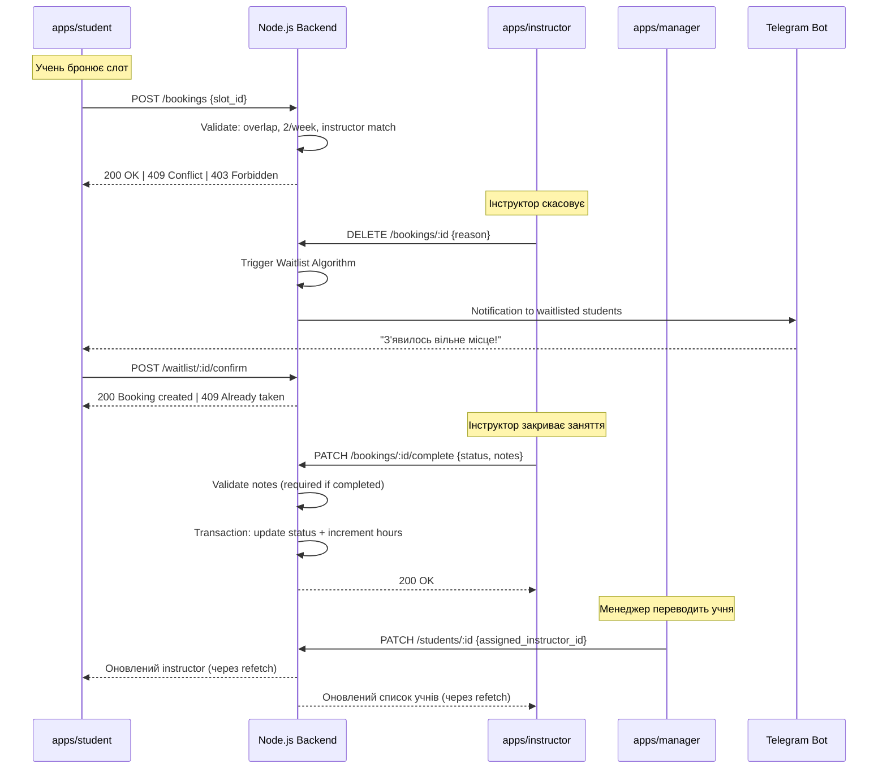

# 📜 Business Rules & Logic Specification (Node.js Backend)

Цей документ описує ключові бізнес-правила системи автоматизації автошколи. Усі наведені нижче правила мають бути реалізовані на рівні сервісів (Services) у Node.js додатку.

---

## 🖥️ Контекст фронтенду (для розуміння API-контрактів)

Фронтенд — це **React monorepo** з трьома окремими SPA-застосунками, кожен зі своїм UI та рольовою моделлю:

| Застосунок | Пакет | Роль | Ключовий функціонал |
|:---|:---|:---|:---|
| `apps/student` | `@bloknotik/student` | Student | Бронювання занять, перегляд прогресу, waitlist, профіль |
| `apps/instructor` | `@bloknotik/instructor` | Instructor | Створення слотів, управління розкладом, закриття занять, нотатки |
| `apps/manager` | `@bloknotik/manager` | Manager | Повний CRUD, Dashboard, перепризначення інструкторів, аналітика |

**Стек фронтенду:** React 18, Vite, Tailwind CSS 4, React Router (manager), React Hook Form, Radix UI, Recharts, Lucide icons, Motion (анімації).

> Бекенд повинен надати REST API, який покриває потреби всіх трьох застосунків. Нижче описані бізнес-правила, які бекенд **зобов'язаний** валідувати та enforc'ити, незалежно від того, чи фронтенд робить клієнтську валідацію.

---

## 1. Управління слотами (Slot Management)

Логіка створення та життєвого циклу робочого часу інструктора.

### 1.1 Динамічна тривалість

Кожен слот може тривати **від 1 до 2 годин**. Інструктор самостійно визначає тривалість під час створення слота в розкладі.

**Правила валідації на бекенді:**
- `end_time - start_time >= 1 година`
- `end_time - start_time <= 2 години`
- Якщо умова не виконана → `400 Bad Request` з повідомленням `"Тривалість слота має бути від 1 до 2 годин"`

**Модель даних:**
```typescript
interface Slot {
  id: string;
  instructor_id: string;
  start_time: DateTime;   // ISO 8601
  end_time: DateTime;     // ISO 8601
  status: 'available' | 'booked' | 'completed' | 'cancelled' | 'no_show';
  booking_id?: string;    // null, якщо status === 'available'
  created_at: DateTime;
  updated_at: DateTime;
}
```

### 1.2 Відсутність накладок (Overlaps)

Один інструктор **не може** мати два слоти, які перетинаються в часі. Система повинна перевіряти перетини перед створенням нового слота.

**Приклад перетину:** слот 10:00–11:30 блокує створення слота 11:00–12:30.

**Реалізація:**
```sql
-- Перевірка overlap у SQL
SELECT COUNT(*) FROM slots
WHERE instructor_id = $1
  AND status != 'cancelled'
  AND start_time < $3   -- new_end_time
  AND end_time > $2;    -- new_start_time
```
- Якщо count > 0 → `400 Bad Request` з повідомленням `"Цей час перетинається з іншим слотом"`

### 1.3 Життєвий цикл слота (Read-Only)

Слот, час якого вже настав або минув (`start_time <= Date.now()`), переходить у режим **Read-Only**:
- Не може бути заброньований
- Не може бути скасований
- Не може бути перенесений
- Якщо спроба модифікації → `410 Gone` з повідомленням `"Цей слот більше не доступний для змін"`

---

## 2. Логіка бронювання та Балансування

Ядро системи для забезпечення рівномірного навчального навантаження.

### 2.1 Жорстка прив'язка до інструктора

Учень бачить розклад і може бронювати заняття **виключно** у свого поточного інструктора (`assigned_instructor_id`).

**Валідація на бекенді:**
```typescript
// SlotService.getAvailableSlots()
if (student.assigned_instructor_id !== requested_instructor_id) {
  throw new ForbiddenError('Ви можете бронювати тільки у свого інструктора');
}
```

**API-ендпоінти для `apps/student`:**
- `GET /slots?instructor_id={id}&date={date}` — вільні слоти інструктора на дату
- `POST /bookings` `{ slot_id }` — бронювання слота

### 2.2 Зміна інструктора

- Учень **не може** самостійно змінити свого інструктора через додаток.
- Інструктор **не може** самостійно передати учня іншому колезі.
- Усі переведення здійснюються **виключно через Менеджера** в панелі адміністратора.

**API-ендпоінт (тільки для `apps/manager`):**
- `PATCH /students/:id` `{ assigned_instructor_id }` — вимагає роль `manager`
- Будь-яка спроба з іншою роллю → `403 Forbidden`

### 2.3 Гарантований мінімум (2 заняття/тиждень)

Система балансує розклад так, щоб кожен учень відкатав **мінімум 2 заняття** на тиждень (Понеділок – Неділя).

**Алгоритм пріоритезації:**
1. Підрахувати кількість занять учня на поточному тижні (Mon–Sun)
2. Якщо учень має **0 або 1** заняття → надати **пріоритетний** доступ до вільних слотів
3. Учні з **2+** заняттями → можуть бронювати лише якщо слоти залишились після пріоритетних

**API-відповідь для фронтенду:**
```typescript
// GET /bookings/availability
interface BookingAvailability {
  can_book: boolean;           // чи може бронювати прямо зараз
  has_priority: boolean;       // true, якщо < 2 занять на тижні
  lessons_this_week: number;   // поточна кількість
  min_required: number;        // = 2
  waitlist_position?: number;  // якщо учень у черзі
}
```

### 2.4 Захист від Race Conditions

Якщо два учні одночасно намагаються зайняти один слот:

**Реалізація:**
- Унікальний індекс на `booking(slot_id)` у БД
- При duplicate key → бекенд перехоплює помилку
- Повертає `409 Conflict` з повідомленням `"Слот вже зайнято"`
- Фронтенд перехоплює 409 і оновлює список слотів

---

## 3. Правила скасування (Cancellation Policy)

Логіка скасування занять для обох сторін.

### 3.1 Безпечне скасування учнем (> 24 год)

Якщо до початку слота залишається **більше 24 годин**, учень може самостійно скасувати заняття без штрафів.

**API:** `DELETE /bookings/:id` — перевірити `start_time - now > 24h`

### 3.2 Пізнє скасування учнем (< 24 год) — ЗАБЛОКОВАНО

Якщо до початку заняття **менше 24 годин**, самостійне скасування для учня **блокується**. Відміна можлива лише через звернення до адміністрації (Менеджер скасовує вручну).

**Валідація на бекенді:**
```typescript
// BookingService.cancelByStudent()
const hoursUntil = differenceInHours(booking.slot.start_time, new Date());
if (hoursUntil < 24) {
  throw new BadRequestError(
    'До заняття менше 24 годин. Самостійне скасування недоступне. Зверніться до адміністрації.'
  );
}
```

> **Поточний баг у фронтенді (`apps/student/App.tsx`):** Modal скасування показує кнопку `variant="danger"` і дозволяє підтвердити скасування навіть при < 24 год. Це потрібно виправити — при < 24 год показувати **лише інформаційне повідомлення** без кнопки скасування. Бекенд ОБОВ'ЯЗКОВО має блокувати такі запити, навіть якщо фронт їх пропустить.

### 3.3 Скасування інструктором (особисті причини)

Інструктор має право скасувати заняття **в будь-який час** з особистих причин (хвороба, поломка авто). Правило 24 годин для нього **не діє**.

**Наслідки скасування інструктором:**
- Заняття **не зараховується** учню в тижневий мінімум
- Система пропонує учню перенести заняття на інший вільний слот
- Тригер Waitlist-алгоритму (якщо є учні в черзі)

**API:** `DELETE /bookings/:id` з `{ cancelled_by: 'instructor', reason: string }`

### 3.4 Привілеї Менеджера

Менеджер може скасувати або перенести **будь-яке** заняття **в будь-який час** без обмежень.

**API:** `DELETE /bookings/:id` з перевіркою `role === 'manager'` → пропустити всі часові валідації.

---

## 4. Алгоритм "Розумної черги" (Waitlist)

Асинхронний процес перерозподілу звільнених місць.

### 4.1 Умова додавання

Учень може стати в чергу на певну дату, якщо у його інструктора **немає вільних слотів** на цю дату.

**API:** `POST /waitlist` `{ date, instructor_id }` → повертає `{ position: number }`

### 4.2 Тригер

Успішне скасування заняття іншим учнем **або** звільнення слота інструктором.

### 4.3 Кроки алгоритму

При звільненні слота (тригер):

1. **Знайти кандидатів:** Всі учні у `waitlist`, підписані на дату звільненого слота у цього конкретного інструктора
2. **Пріоритизація за мінімумом:** Надати **абсолютний пріоритет** учням, які ще **не виконали мінімум** (< 2 занять на тижні)
3. **Вторинне сортування:** Якщо всі виконали мінімум (або таких немає) → відсортувати за полем `total_hours_driven` **за зростанням** (пріоритет тим, хто відкатав найменше за весь час)
4. **Сповіщення:** Надіслати **Топ-N** учням сповіщення (Telegram / Push)
5. **First Come, First Served:** Хто перший підтвердить → отримує місце

**Модель даних:**
```typescript
interface WaitlistEntry {
  id: string;
  student_id: string;
  instructor_id: string;
  date: string;         // YYYY-MM-DD
  created_at: DateTime;
  status: 'waiting' | 'notified' | 'confirmed' | 'expired';
}
```

**API для підтвердження з черги:**
- `POST /waitlist/:id/confirm` → бронює слот, видаляє з черги
- Якщо слот вже зайнятий (race condition) → `409 Conflict`

### 4.4 Відповідь для фронтенду

```typescript
// GET /waitlist/status
interface WaitlistStatus {
  in_waitlist: boolean;
  position: number;
  date: string;
  instructor_id: string;
}

// Push-сповіщення (WebSocket / Telegram)
interface WaitlistNotification {
  type: 'slot_available';
  slot_id: string;
  slot_time: string;       // "10:00 - 11:30"
  expires_at: string;      // дедлайн підтвердження (15 хв)
}
```

---

## 5. Облік прогресу (Post-Lesson Logic)

Дії, що виконуються після фактичного завершення заняття.

### 5.1 Закриття слота

Після завершення часу заняття, інструктор зобов'язаний оновити статус на:
- `completed` — заняття відбулось успішно
- `no_show` — учень не з'явився

**API:** `PATCH /bookings/:id/complete`

```typescript
interface CompleteLessonPayload {
  status: 'completed' | 'no_show';
  notes?: string;  // ОБОВ'ЯЗКОВО при status === 'completed'
}
```

### 5.2 Оновлення балансу годин

Якщо статус `completed`:
- Система додає **фактичну тривалість слота** (від 1 до 2 годин) до `total_hours_driven` учня
- Оновлення ПОВИННО відбуватись **в одній транзакції** з зміною статусу

```typescript
// В одній транзакції:
await prisma.$transaction([
  prisma.booking.update({ where: { id }, data: { status: 'completed', notes } }),
  prisma.student.update({
    where: { id: booking.student_id },
    data: { total_hours_driven: { increment: slotDurationHours } },
  }),
]);
```

### 5.3 Обов'язкові нотатки

Для статусу `completed` інструктор **повинен** додати текстову нотатку про прогрес:
- Порожні значення (`""`, `null`, whitespace-only) → `400 Bad Request` `"Нотатка про прогрес обов'язкова"`
- Для `no_show` нотатка **опціональна**

**Модель нотатки (відображається в `apps/student`, tab "Профіль"):**
```typescript
interface LessonNote {
  id: string;
  booking_id: string;
  instructor_id: string;
  student_id: string;
  text: string;
  created_at: DateTime;
}
```

---

## 6. Рольова модель та доступи (Authorization / RBAC)

Сувора перевірка JWT-токенів за допомогою Middleware/Guards.

### 6.1 Таблиця ролей

| Роль | Права доступу (Permissions) | Обмеження |
|:---|:---|:---|
| **Student** | Читання своїх бронювань, прогресу, нотаток. Перегляд вільних слотів свого інструктора. Додавання до waitlist. | Не може змінити свого інструктора. Не має доступу до даних інших учнів. Не може скасувати при < 24 год. |
| **Instructor** | Перегляд розкладу своїх учнів. Створення слотів тривалістю 1–2 год. Скасування занять без часових обмежень. Додавання нотаток. Закриття занять (completed/no_show). | Не може передати учня іншому інструктору. Не бачить чужі розклади. |
| **Manager** | Повний CRUD доступ до всієї системи. Скасування/перенесення без обмежень. Перегляд всіх розкладів та аналітики. | **Єдиний, хто має право створювати акаунти інструкторів та змінювати прив'язку (Instructor ↔ Student).** |

### 6.2 Матриця ендпоінтів за роллю

| Ендпоінт | Student | Instructor | Manager |
|:---|:---:|:---:|:---:|
| `GET /slots?instructor_id=` | ✅ (тільки свій) | ✅ (тільки свої) | ✅ (всі) |
| `POST /slots` | ❌ | ✅ | ✅ |
| `POST /bookings` | ✅ | ❌ | ✅ |
| `DELETE /bookings/:id` | ✅ (> 24 год) | ✅ (завжди) | ✅ (завжди) |
| `PATCH /bookings/:id/complete` | ❌ | ✅ | ✅ |
| `POST /waitlist` | ✅ | ❌ | ❌ |
| `PATCH /students/:id` (instructor change) | ❌ | ❌ | ✅ |
| `POST /instructors` (create account) | ❌ | ❌ | ✅ |
| `GET /analytics/*` | ❌ | ❌ | ✅ |

### 6.3 JWT та Auth

```typescript
interface JWTPayload {
  sub: string;           // user ID
  role: 'student' | 'instructor' | 'manager';
  name: string;
  assigned_instructor_id?: string;  // тільки для student
  iat: number;
  exp: number;
}
```

**Auth endpoints:**
- `POST /auth/login` `{ email, password }` → `{ access_token, refresh_token, user }`
- `POST /auth/refresh` `{ refresh_token }` → `{ access_token }`
- `POST /auth/logout`

---

## 7. HTTP-статуси та формат помилок

Єдиний формат помилок для всього API:

```typescript
interface ApiError {
  status: number;
  code: string;           // машиночитаний код
  message: string;        // людиночитаний опис (українська)
}
```

| HTTP Status | Код | Коли використовувати |
|:---|:---|:---|
| `400` | `VALIDATION_ERROR` | Невалідні вхідні дані (тривалість слота, порожня нотатка) |
| `401` | `UNAUTHORIZED` | Відсутній або протухший JWT |
| `403` | `FORBIDDEN` | Немає прав (RBAC) |
| `404` | `NOT_FOUND` | Ресурс не знайдено |
| `409` | `CONFLICT` | Race condition (слот вже зайнято) |
| `410` | `GONE` | Read-only слот (час минув) |

Фронтенд обробляє ці статуси глобально через axios interceptor і показує відповідні `toast` / `Banner`.

---

## 8. Повний список API-ендпоінтів

### Auth
| Method | Endpoint | Body | Response | Auth |
|:---|:---|:---|:---|:---|
| POST | `/auth/login` | `{ email, password }` | `{ access_token, refresh_token, user }` | ❌ |
| POST | `/auth/refresh` | `{ refresh_token }` | `{ access_token }` | ❌ |
| POST | `/auth/logout` | — | `204` | ✅ |

### Slots (Instructor)
| Method | Endpoint | Body | Response | Roles |
|:---|:---|:---|:---|:---|
| GET | `/slots?instructor_id=&date=` | — | `Slot[]` | all |
| POST | `/slots` | `{ start_time, end_time }` | `Slot` | instructor, manager |
| DELETE | `/slots/:id` | — | `204` | instructor (свій), manager |

### Bookings (Student)
| Method | Endpoint | Body | Response | Roles |
|:---|:---|:---|:---|:---|
| GET | `/bookings` | — | `Booking[]` (фільтр за роллю) | all |
| GET | `/bookings/availability` | — | `BookingAvailability` | student |
| POST | `/bookings` | `{ slot_id }` | `Booking` | student, manager |
| DELETE | `/bookings/:id` | `{ reason?, cancelled_by? }` | `204` | student (> 24h), instructor, manager |
| PATCH | `/bookings/:id/complete` | `{ status, notes? }` | `Booking` | instructor, manager |

### Waitlist
| Method | Endpoint | Body | Response | Roles |
|:---|:---|:---|:---|:---|
| POST | `/waitlist` | `{ date, instructor_id }` | `{ position }` | student |
| GET | `/waitlist/status` | — | `WaitlistStatus` | student |
| POST | `/waitlist/:id/confirm` | — | `Booking` | student |
| DELETE | `/waitlist/:id` | — | `204` | student, manager |

### Users (Manager)
| Method | Endpoint | Body | Response | Roles |
|:---|:---|:---|:---|:---|
| GET | `/students` | — | `Student[]` | manager |
| GET | `/students/:id` | — | `Student` | manager, instructor (свої) |
| PATCH | `/students/:id` | `{ assigned_instructor_id }` | `Student` | manager |
| GET | `/instructors` | — | `Instructor[]` | manager |
| POST | `/instructors` | `{ name, email, ... }` | `Instructor` | manager |
| GET | `/instructors/:id/students` | — | `Student[]` | instructor (свій), manager |

### Progress & Notes
| Method | Endpoint | Body | Response | Roles |
|:---|:---|:---|:---|:---|
| GET | `/students/:id/progress` | — | `{ total_hours_driven, lessons_completed }` | student (свій), instructor (свої учні), manager |
| GET | `/students/:id/notes` | — | `LessonNote[]` | student (свої), instructor (свої), manager |

---

## 💡 Рекомендації щодо архітектури (Node.js)

### Шари додатку

```
src/
├── controllers/          # HTTP: прийом запитів, валідація вхідних даних
│   ├── auth.controller.ts
│   ├── slot.controller.ts
│   ├── booking.controller.ts
│   ├── waitlist.controller.ts
│   └── user.controller.ts
├── services/             # Бізнес-логіка (ВСІ ПРАВИЛА З ЦЬОГО ДОКУМЕНТА)
│   ├── slot.service.ts           # overlap, тривалість, read-only
│   ├── booking.service.ts        # бронювання, скасування, 24h rule, пріоритети
│   ├── waitlist.service.ts       # алгоритм черги, сповіщення
│   ├── progress.service.ts       # total_hours, нотатки, закриття заняття
│   └── student.service.ts        # зміна інструктора (тільки manager)
├── repositories/         # Data Access через Prisma або TypeORM
│   ├── slot.repository.ts
│   ├── booking.repository.ts
│   └── ...
├── middleware/
│   ├── auth.middleware.ts        # JWT verification
│   └── rbac.middleware.ts        # Role-based access control
├── utils/
│   ├── errors.ts                 # Custom error classes
│   └── validators.ts             # Zod / Joi schemas
└── prisma/
    └── schema.prisma             # Database schema
```

### Ключові принципи

1. **Controllers / Routers:** Відповідають лише за прийом HTTP-запитів та валідацію вхідних даних (Zod/Joi). Жодної бізнес-логіки.
2. **Services:** Місце, де імплементовані **ВСІ** правила з цього документа. Наприклад:
   - `BookingService.cancelByStudent()` — перевірка 24-год правила
   - `SlotService.create()` — перевірка overlap та тривалості
   - `WaitlistService.processFreedSlot()` — алгоритм пріоритезації
3. **Repositories / Data Access:** Рівень абстракції для роботи з БД через Prisma або TypeORM.
4. **Middleware:** JWT-верифікація + RBAC guards перед кожним ендпоінтом.

---

## 📊 Взаємодія Frontend ↔ Backend


